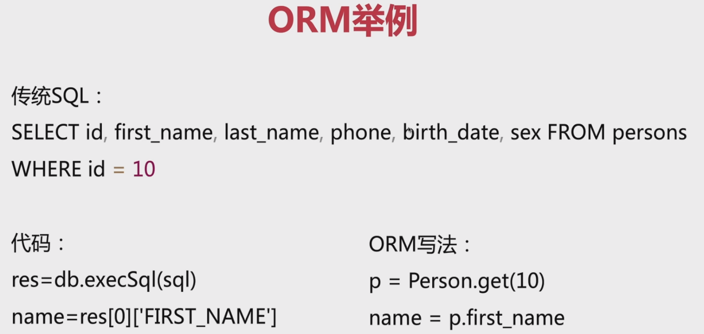

## ORM
### 概念与作用
* ORM(Object Relational Mapping)对象关系映射，其主要作用是在编程中，把面向对象的概念跟数据库中的概念对应起来
* 举例子：
定义一个对象，那就对应着一张表，这个对象的实例，就对应着表中的一条记录
* Object <=> Mapping <=> DB

### 特点
* 方便维护：数据模型定义在同一个地方，利于重构
* 代码量少、对接多种库：代码逻辑更易懂
* 工具多、自动化能力强：数据库删除关联数据、事务操作（回滚）等

### 常用ORM
* prisma
* sequelize
* typeORM
