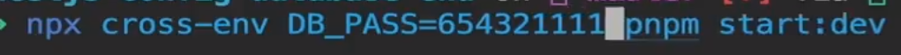

## 多环境配置
* 安装依赖
```js
pnpm i --save @nestjs/config@2.2.0
```
### 创建环境文件
1. 根目录下创建.env文件


### 使用配置
1. app.module.ts文件引入
```js
import { ConfigModule } from '@nestjs/config';

@Module({
  imports: [
    ConfigModule.forRoot({
      isGlobal: true,
    }),
    UserModule,
  ],
  controllers: [],
  providers: [],
})

```
ConfigModule.forRoot({ isGlobal: true }) : 读取根目录下的env文件, 且设为全局
采取枚举的方式引入环境变量
```ts
export enum ConfigEnum {
  DB = 'DB',
  DB_HOST = 'DB_HOST',
}

```

2. 使用envFilePath属性可以指定读取环境文件
```ts


```

3. 安装cross-env帮助我们设置process.env.NODE_ENV
```ts
// package.json
// 把其中start:dev等几个命令进行改造
  "scripts": {
    ...,
    "start:dev": "nest build --webpack --webpackPath webpack-hmr.config.js --watch",
    "start:debug": "nest start --debug --watch",
    "start:prod": "node dist/main",
  },

```
3.1 对 app.modules 进行改造
```ts

const envFilePath = `.env.${process.env.NODE_ENV || `development`}`;

@Module({
  imports: [
    ConfigModule.forRoot({
      isGlobal: true,
      envFilePath, // 这里直接使用envFilePath
    }),
    UserModule,
  ],
  controllers: [],
  providers: [],
})

```

4. .env文件作为公共的环境文件
* 通过dotenv来读取.env文件
* 安装依赖
```js
pnpm i dotenv
```

对 app.modules 进行改造
```ts
import * as dotenv from 'dotenv';

@Module({
  imports: [
    ConfigModule.forRoot({
      isGlobal: true,
      envFilePath,
      load: [() => dotenv.config({ path: '.env' })], //利用dotenv读取根目录的下.env文件
    }),
    UserModule,
  ],
  controllers: [],
  providers: [],
})

```

如果.env.development / .env.production 文件中的变量与.env 有冲突，
则会优先使用前者的，否则以.env为主，这就达到了使用.env作为公共的环境配置文件，
另外其他环境配置文件也可以针对特定变量进行覆盖配置

## 热重载
1. 安装依赖
```js
npm i --save-dev webpack-node-externals run-script-webpack-plugin webpack
```
2. 根目录下 - 创建配置文件
webpack-hmr.config.js
* 配置详见对应文件

3. main.ts 使用
* 安装依赖 - 以防ts报错
- npm i -D @types/webpack-env
```js
async function bootstrap() {
  your code...

  // 热重载
  if (module.hot) {
    module.hot.accept();
    module.hot.dispose(() => app.close());
  }
}
bootstrap();

```

4. package.json - 脚本代码修改
* 把原来的"start:dev" 替换成如下代码
```js
  "scripts": {
    ...,
    "start:dev": "nest build --webpack --webpackPath webpack-hmr.config.js --watch"
  },
```

5. 执行


## docker跑mysql

